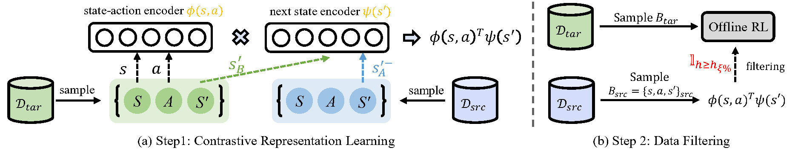

# Contrastive Representation for Data Filtering in Cross-Domain Offline Reinforcement Learning
Code for the ICML 2024 paper "Contrastive Representation for Data Filtering in Cross-Domain Offline Reinforcement Learning". 


## Tasks and Datasets
1. We set D4RL datasets as our target domain. For the source domain, we change the environment parameters and then collect the source offline datasets in the changed environments.
2. For body mass shift and joint noise shift, we follow the same setting of DARA, wherein 1) "Medium" offline data, generated by a trained policy with the “medium” level of performance in the source environment, 2) "Medium-Replay" offline data, consisting of recording all samples in the replay buffer observed during training until the policy reaches the “medium” level of performance, 3) "Medium-Expert" offline data, mixing equal amounts of expert demonstrations and ”medium” data in the source environment.
3. For broken thighs and morphology shift, we alter the XML file of the Mujoco simulator following VGDF, and then collect 1M replay transitions with SAC in every benchmark.

## Getting started
The training environment (PyTorch and dependencies) can be installed as follows:
```bash
cd IGDF
conda activate -n igdf python=3.8
pip install -r requirements/requirements_dev.txt
```

## Train
### Hyperparameters
Representation dimension *d* : 16 or 64 \
Update number: 7000 \
Importance coefficient $\alpha$ : 1.0 \
Info batch size : 128 \
Data selection ratio $\xi$ : 0.25 or 0.75 \
env_name : 41(mass) or 46(joint) or 51(broken) or 56(morphology)

### IGDF+IQL
```bash
python igdf.py --seed 12 --env halfcheetah-medium-v2 --env_num 41 --xi 0.25 --alpha 1.0
```

## Notice
1. For the *HalfCheetah-v2* and *Hopper-v2* environments are more suitable for smaller sampling ratios ($\xi$ = 25\%)
2. For the *Walker2d-v2* environment is more suitable for a relatively large sampling ratio ($\xi$ = 75\%).

## References
```bib
@inproceedings{
wen2024contrastive,
title={Contrastive Representation for Data Filtering in Cross-Domain Offline Reinforcement Learning},
author={Xiaoyu Wen, Chenjia Bai, Kang Xu, Xudong Yu, Yang Zhang, Xuelong Li, Zhen Wang},
booktitle={Forty-first International Conference on Machine Learning},
year={2024},
url={https://openreview.net/forum?id=rReWhol66R}
}
```
